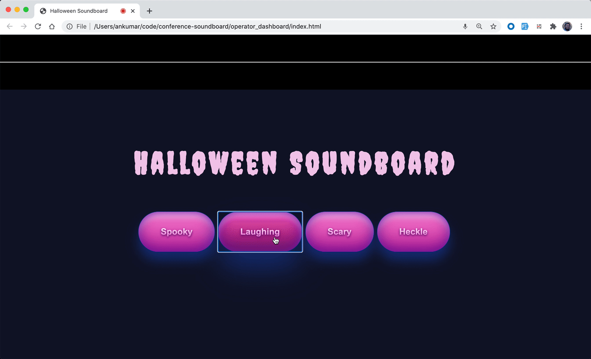

### Project Overview

This project demonstrates using Twilio <Conference> Announcements to create a spooky Halloween soundboard. The same principles can be used to create other Conference Announcements like when there's only a certain amount of time remaining in a meeting or notifying everyone when someone important joins a room!

### Setup
Full setup instructions are available in [this walk-through tutorial](https://blog.twilio.com)!

### Contributors
Ankur Kumar

